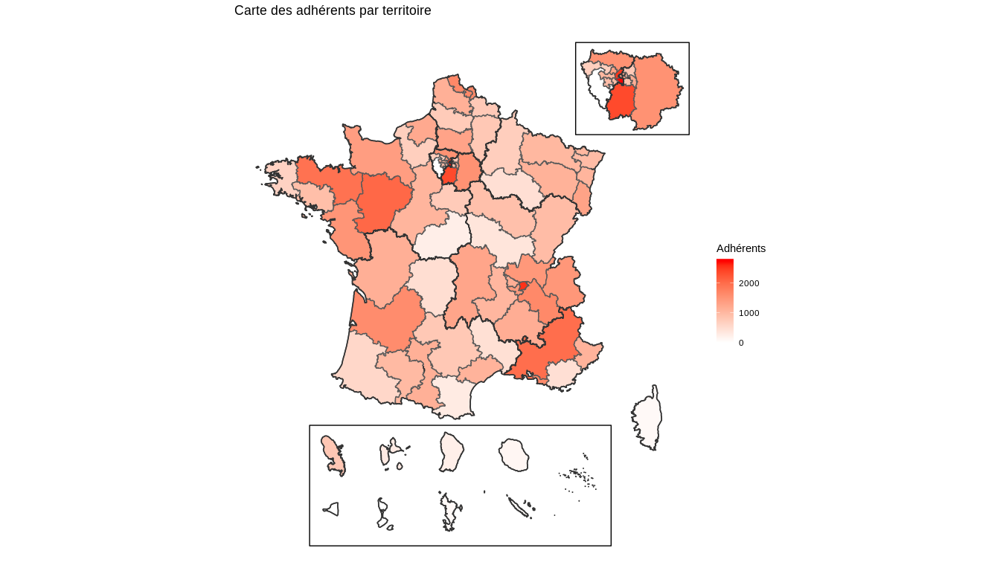

Fonds de cartes territoriaux
================
Equipe développement SGDF
14 avril 2019

Les fichiers
------------

Différents fichiers spatiaux, de type Shapefile (en .shp) ont été créés :

-   Au niveau des territoires :
    -   Un fichier entier, avec les DOM à leur vraie position ;
    -   Un fichier avec les DOM ajoutés en dessous de la France métropolitaine ;
    -   Un fichier avec les DOM et un encart pour l'Île-de-France.
-   Au niveau des centres de ressources, de façon symétrique :
    -   Un fichier entier, avec les DOM à leur vraie position ;
    -   Un fichier avec les DOM ajoutés en dessous de la France métropolitaine ;
    -   Un fichier avec les DOM et un encart pour l'Île-de-France.

Les modifications
-----------------

Le fichier **Codes/Gestion\_shp.R** a été utilisé pour effectuer les modifications :

-   Mise au format des variables ;
-   Modification de la zone du sud des Yvelines ;
-   Ajout des DOM et de l'Île-de-France ;
-   Fusion au niveau des centres de ressources.

Subsistent quelques problèmes/modifications à faire :

-   Au niveau de Paris et de la frontière de l'Occitanie, quelques problèmes de bordures apparaissent (à traiter plutôt dans l'import) ;
-   Mettre les libellés au format Majuscule/Minuscule ;
-   Ajout du territoire Monde.

Exemple d'utilisation
---------------------

On charge les packages, le fond de carte DOM + Île-de-France, au territoire et au centre de ressources, les coordonnées des polygones d'encart et un fichier avec le nombre d'adhérents par territoire (arrondi à la dizaine) comme exemple.

``` r
library(tidyverse)
library(sf)

shp_terr_dom_idf <- st_read("Shapefiles/Territoires/shp_terr_dom_idf.shp")
```

    ## Reading layer `shp_terr_dom_idf' from data source `/home/thomas/Documents/Scoutisme - statistique/Toolbox/SGDF_shp_territoires/Shapefiles/Territoires/shp_terr_dom_idf.shp' using driver `ESRI Shapefile'
    ## Simple feature collection with 97 features and 7 fields
    ## geometry type:  MULTIPOLYGON
    ## dimension:      XY
    ## bbox:           xmin: 99226 ymin: 5821429 xmax: 1303519 ymax: 7180451
    ## epsg (SRID):    NA
    ## proj4string:    +proj=lcc +lat_1=49 +lat_2=44 +lat_0=46.5 +lon_0=3 +x_0=700000 +y_0=6600000 +ellps=GRS80 +units=m +no_defs

``` r
shp_cr_dom_idf <- st_read("Shapefiles/Centres_ressources/shp_cr_dom_idf.shp")
```

    ## Reading layer `shp_cr_dom_idf' from data source `/home/thomas/Documents/Scoutisme - statistique/Toolbox/SGDF_shp_territoires/Shapefiles/Centres_ressources/shp_cr_dom_idf.shp' using driver `ESRI Shapefile'
    ## Simple feature collection with 9 features and 4 fields
    ## geometry type:  MULTIPOLYGON
    ## dimension:      XY
    ## bbox:           xmin: 99226 ymin: 5821429 xmax: 1303519 ymax: 7180451
    ## epsg (SRID):    NA
    ## proj4string:    +proj=lcc +lat_1=49 +lat_2=44 +lat_0=46.5 +lon_0=3 +x_0=700000 +y_0=6600000 +ellps=GRS80 +units=m +no_defs

``` r
polygones_encart <- read_rds("Shapefiles/encarts_polygones_dom_idf.rds")

adherents_terr <- read_rds("Data/data_adherents_terr.rds")
```

On fusionne ensuite les données d'adhérents et le fond de carte (attention, dans un SHP, le nom des variables est condensé).

``` r
adherents_terr_shp <- shp_terr_dom_idf %>%
  left_join(adherents_terr, by = c("cd_trr_c" = "code_terr_court", "code_cr"))
```

On fait ensuite la carte, en incluant les polygones.

``` r
ggplot() +
  geom_sf(data = adherents_terr_shp, aes(fill = nb_adherents_arrondi)) +
  geom_sf(data = shp_cr_dom_idf, alpha = 0, color = "grey20", lwd = 0.6) +
  geom_polygon(data = polygones_encart, aes(x = x_dom, y = y_dom), alpha = 0, color = "black") +
  geom_polygon(data = polygones_encart, aes(x = x_idf, y = y_idf), alpha = 0, color = "black") +
  scale_fill_gradient(name = "Adhérents", low = "white", high = "red", na.value = "white") +
  theme_void() +
  theme(panel.grid = element_line(NULL)) +
  ggtitle(label = "Carte des adhérents par territoire")
```


